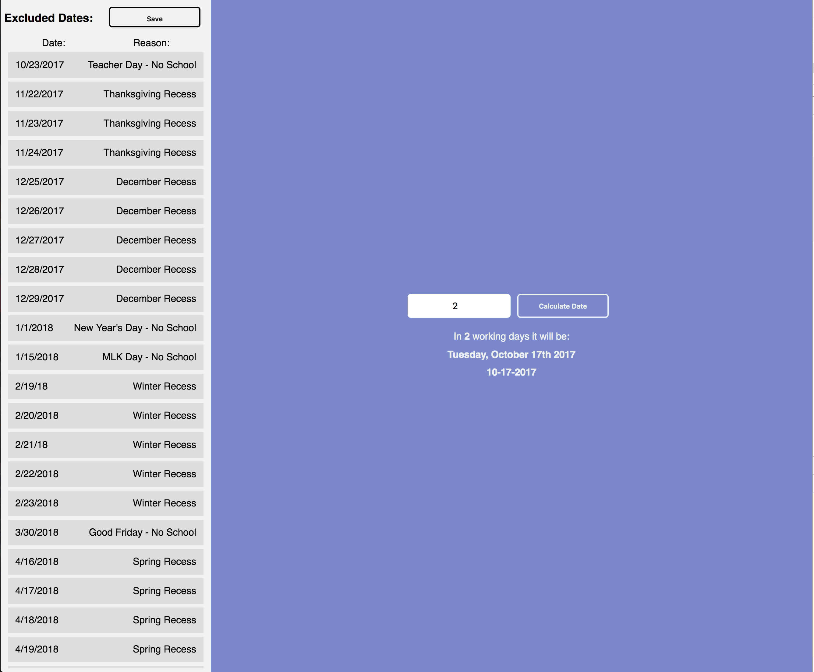

# School Working Days Calculator

Often people would like to be able to calculate the number of "working days" from now. For instance, 10 working days is often 14 regular days.

Additionally, there are holidays to take into account as well as days particular to your organization.

### In this version this application can do

- [x] Calculate the number of "working days" from today (weekdays excluding weekends)
- [ ] Customize any additional days you would like to exclude
- [x] Save your excluded days and share them with your co-workers via a url



## Requirements

You need the following to run the application

- Node
- Yarn

## Demo

You can test the appilcation here:
https://michaelghinrichs.github.io/school-working-days-calculator/

## How can you download and use it?

Its very simple to download and use the application, just follow these steps:

```
  $ git clone https://github.com/michaelghinrichs/school-working-days-calculator.git
  $ cd school-working-days-calculator
  $ yarn
  $ yarn start

  Now enjoy!
```

### How can you help us?

- Star our GitHub repo
- Create pull requests, submit bugs, suggest new features or documentation updates

## License

This project has an MIT license, because we <3 open source.
